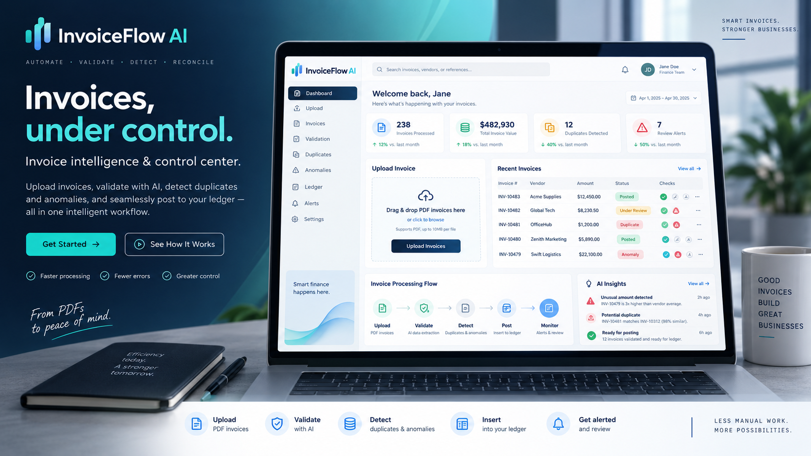
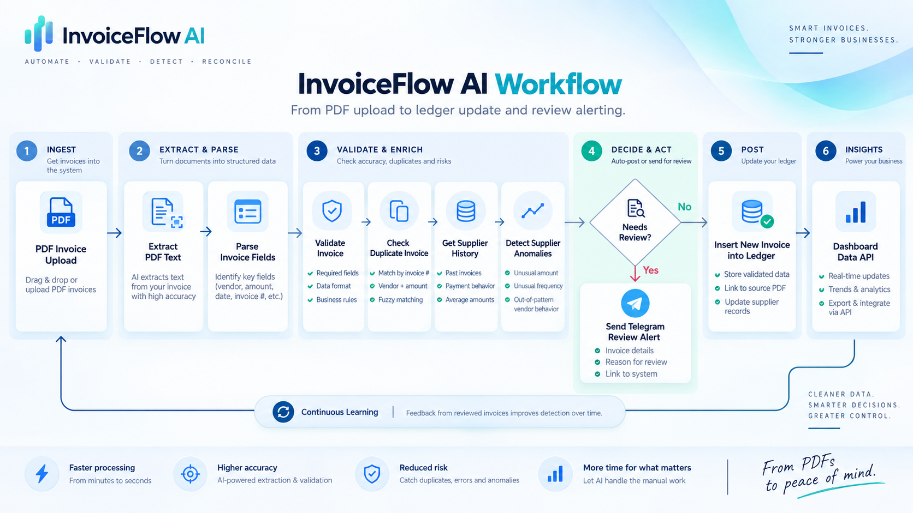
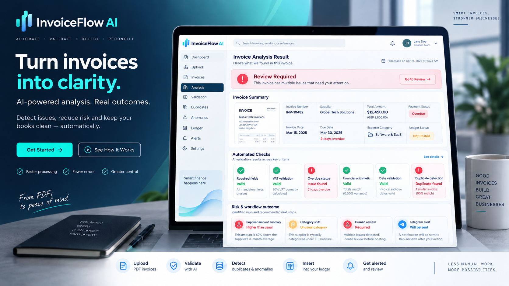
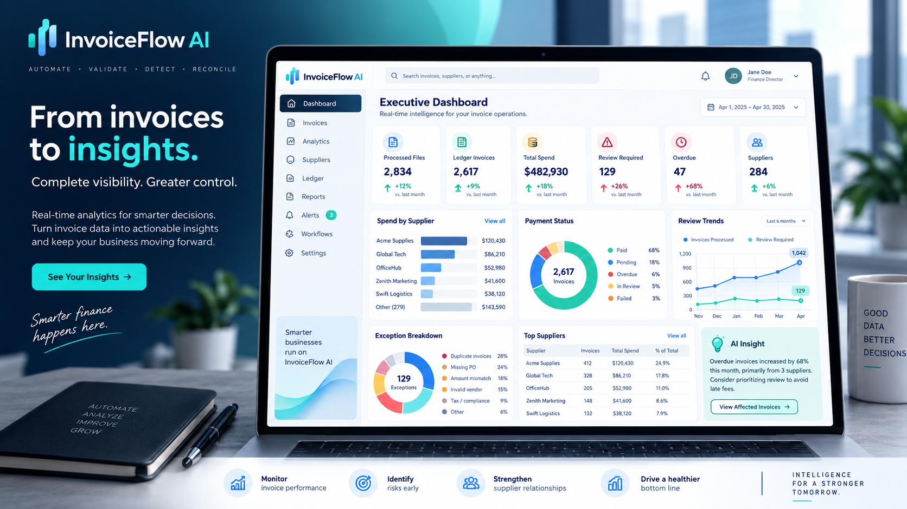

# InvoiceFlow AI


> **Public portfolio repository — implementation intentionally withheld.**

InvoiceFlow AI is an automated invoice-processing and financial-operations MVP that turns PDF invoices into structured, validated, review-ready records and operational dashboards.

**Key capabilities:** Invoice parsing · Validation · Duplicate detection · Overdue monitoring · Supplier anomaly detection · Telegram alerts · Dashboard API



> *Conceptual product visualization for presentation purposes. It is not a literal application screenshot.*

## What the project does

InvoiceFlow AI automates the path from invoice upload to operational review. The system extracts structured invoice fields, validates financial and date rules, checks overdue status and duplicate risk, evaluates supplier-level anomalies, stores approved records in a master ledger, sends review alerts, and exposes dashboard data through a dedicated API.

### Core capabilities

- PDF invoice ingestion and field extraction
- Required-field and invoice-number validation
- Arithmetic checks: `Subtotal + VAT ≈ Total`
- Currency-aware VAT validation
- Due-date and overdue checks
- Duplicate detection using invoice number + supplier
- Supplier amount anomaly detection
- Supplier category-shift detection
- Master Ledger storage
- Telegram review alerts
- Streamlit operational interface
- Dashboard API backed by the Master Ledger
- Light and dark UI modes

## How it works



> *Conceptual workflow visualization. The private production workflow contains the implementation details and node logic.*

At a high level, the processing path is:

```text
PDF Invoice
    │
    ▼
Streamlit UI
    │
    ▼
n8n Webhook
    │
    ├─ Extract PDF text
    ├─ Parse invoice fields
    ├─ Validate invoice
    ├─ Check overdue status
    ├─ Detect duplicates
    ├─ Analyze supplier history
    ├─ Route review alerts
    └─ Insert approved/new invoice into Master Ledger
                 │
                 ├──────────────► Telegram Alerts
                 │
                 └──────────────► Dashboard Data API
                                      │
                                      ▼
                                 Streamlit Dashboard
```

## Validation and review experience

The operational result view brings invoice metadata, validation outcomes, overdue status, duplicate detection, anomaly flags, review state, and ledger action into one interface.



> *Conceptual product visualization for presentation purposes. Values and UI details are illustrative.*

## Dashboard and insights

The dashboard reads from the complete Master Ledger through a dedicated n8n API rather than relying on browser-local history. Currency filters are handled separately so AED, SAR, and USD totals are not mixed.



> *Conceptual product visualization for presentation purposes. It illustrates the intended analytics experience rather than exposing production data.*

## Technology stack

| Layer | Technology |
|---|---|
| Data processing | Python |
| Notebook development | Jupyter Notebook |
| Workflow automation | n8n Cloud |
| Operational UI | Streamlit |
| Workflow storage | n8n Data Tables |
| Alerts | Telegram |
| BI / reporting | Power BI |
| Data exchange | JSON / CSV / Excel / PDF |

## Validation and workflow testing

The workflow was tested across three main production branches:

1. **Clean invoice** → processed and added to the ledger.
2. **Review-required invoice** → validation/overdue reason preserved, alert sent, record added for review.
3. **Duplicate invoice** → duplicate detected, alert sent, insertion blocked.

The Dashboard Data API was also tested end-to-end against the Master Ledger.

## Repository scope

This repository is intentionally a **portfolio-safe public release**. It demonstrates the architecture, product design, interface concept, validation strategy, and test outcomes without publishing the proprietary implementation.

The following are intentionally **not included**:

- Full Python/Jupyter processing pipeline
- Production Streamlit source code
- n8n workflow export / node code
- Parsing and anomaly-detection implementation
- Power BI `.pbix` file and DAX implementation
- Training or benchmark datasets
- Generated invoice corpus
- Production webhook URLs
- Telegram identifiers or credentials
- Master Ledger data or execution history

See [Public Repository Scope](docs/PUBLIC_REPOSITORY_SCOPE.md) for details.

## Project overview

A concise illustrated project overview is available here:

[InvoiceFlow AI — Project Overview (PDF)](docs/InvoiceFlow_AI_Project_Overview_EN.pdf)

## Status

**Production-ready MVP / portfolio release.**  
The public repository is documentation-focused; the private implementation remains with the project owner.

## Usage and intellectual property

This repository is provided for **portfolio review and demonstration only**. No permission is granted to copy, reproduce, redistribute, reverse engineer, commercialize, or create derivative implementations from the proprietary project materials.

See [LICENSE](LICENSE) for the repository terms.
